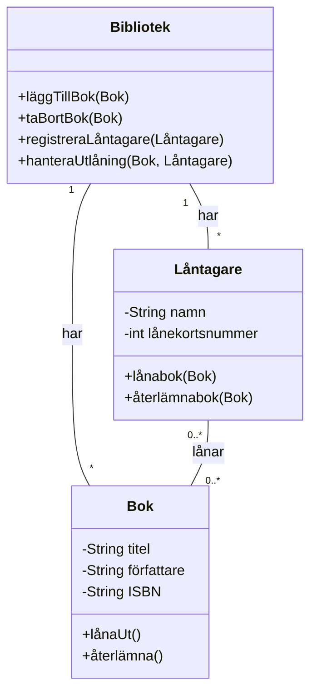

```mermaid
classDiagram
    class Bok {
        -String titel
        -String författare
        -String ISBN
        +lånaUt()
        +återlämna()
    }
    class Låntagare {
        -String namn
        -int lånekortsnummer
        +lånabok(Bok)
        +återlämnabok(Bok)
    }
    class Bibliotek {
        +läggTillBok(Bok)
        +taBortBok(Bok)
        +registreraLåntagare(Låntagare)
        +hanteraUtlåning(Bok, Låntagare)
    }
    Bibliotek "1" -- "*" Bok : har
    Bibliotek "1" -- "*" Låntagare : har
    Låntagare "0..*" -- "0..*" Bok : lånar
```